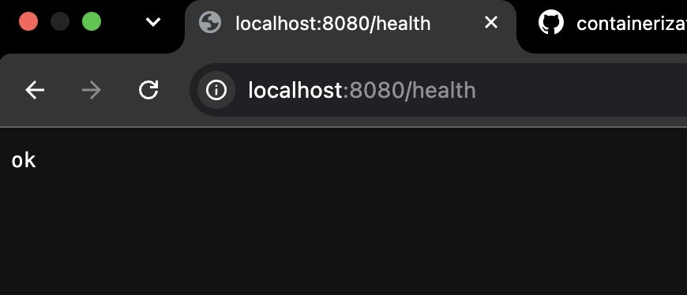
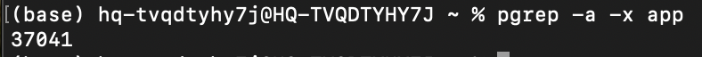

# Лабораторная работа №1

## Часть 0 - Свой сервис
Сервис написан на языке Go

Для запуска сервиса выполнить команду:

```bash
go build -o app main.go
./app
```

## Часть 1 - Запусти напрямую
/health отдает ok



PID процесса нашла:



## Часть 2 - namespaces
unshare - это шткука для линукса, а на маке просто нет концепции пространства имен:(

Поэтому на этом этапе было принято решение закоммитить то, что есть и перейти на другой комп с linux mint....