# Лабораторная работа №1

## Часть 0 - Свой сервис
Сервис написан на языке Go

Для запуска сервиса выполнить команду:

```bash
go build -o app main.go
./app
```

## Часть 1 - Запусти напрямую
/health отдает ok


PID процесса нашла:


## Часть 2 - namespaces
unshare - это шткука для линукса, а на маке просто нет концепции пространства имен:(

Поэтому на этом этапе было принято решение закоммитить то, что есть и перейти на другой комп с linux mint....

На линуксе стала проверять все этапы выше и столкнулась с тем, что ручка не отдает "ок"... Оказалось просто, что линукс я не включала почти 2 года и у меня устарела версия гошки))) Обновилась и все заработало

Запускаю команду
```bash
unshare --user --map-root-user --pid --fork --mount-proc --mount --net --uts --ipc app
```
Что делают флаги:
* **`--user --map-root-user`** изолриует user namespace, проецирует текущего пользователя снаружи га пользователя root внутри
* **`--pid --fork`** изолирует PID namespace
* **`--mount-proc`** монтирует новую файловую систему /proc
* **`--mount`** изолирует mount namespace (точки монтирования)
* **`--net`** изолирует network namespace (сеть)
* **`--uts`** изолирует UTS namespace (имя хоста)
* **`--ipc`** изолирует IPC namespace (межпроцессорное взаимодействие)

Чтобы подключить новые процесс bash ко всем пространствам имен сервиса использую утилиту **`nsenter`**

Теперь делаю ps aux внутри своего "контейнера" и нахожу свой бинарника сервиса с PID 1

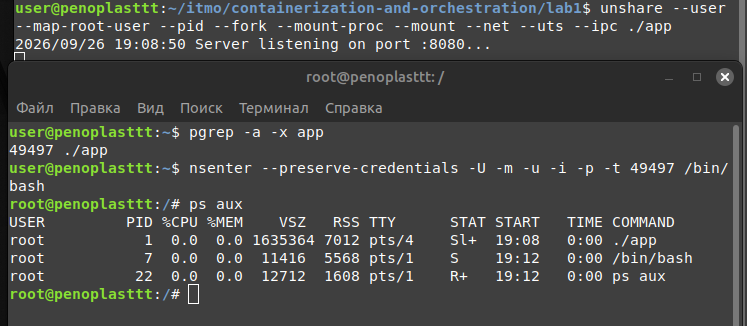

Снаружи PID процесса выглядит так

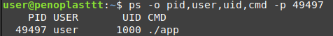

## Часть 3 - cgroups

Для начала я создала свою контрольную группу
```bash
sudo mkdir /sys/fs/cgroup/lab_container
```
и поместила процесс в cgroup
```bash
echo 49497 | sudo tee /sys/fs/cgroup/lab_container/cgroup.procs
```
### Теперь начинаю тестировать лимит по памяти и устраивать ООМ
Для этого задала четкий лимит в 50М
```bash
echo 50M | sudo tee /sys/fs/cgroup/lab_container/memory.max
```
Чтобы отправить курл и протестировать, я подняла лупбэк
```bash
ip link set lo up
```
Я отправила запрос и запросила 100МБ, но сервис успешно ответил и не упал с ООМ

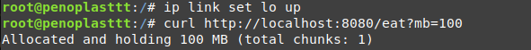

После речерча я выяснила, что причина этого кроется в файле подкачки (swap). Лимит memory.max ограничивает только потребление физической оперативной памяти. Когда мой сервис попытался выделить 100МБ, ядро позволило занять 50МБ в RAM, а остальные данные вытеснило в swap на жесткий диск. В системе кубера swap вроде как откючен на уровне узла, чтобы лимиты работали жестко. Я сделаю аналогично, запрещу своей контрольной группе использовать swap
```bash
echo 0 | sudo tee /sys/fs/cgroup/lab_container/memory.swap.max
```
Снова отправляю запрос и ответ убил

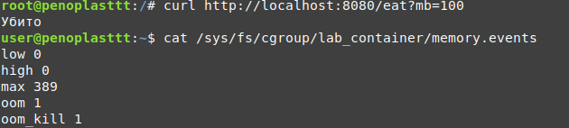

### Перехожу к лимитам CPU

Заново поднимаю свой контейнер и добавляю его в группу. Устанавливаю ограничение потребления CPU до 50%
```bash
echo "50000 100000" | sudo tee /sys/fs/cgroup/lab_container/cpu.max
```
Отправляю соответсвующий курл сервису и наблюдаю рост потребления в диспетчере

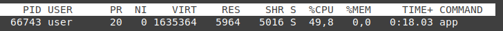

И смотрю в журнал, счетчик nr_throttled показывает сколько раз процесс был принудительно придушен

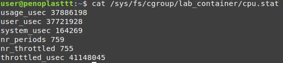

### Лимит процессов

Устанавливаю лимит на количество процессов
```bash
echo 20 | sudo tee /sys/fs/cgroup/lab_container/pids.max
```
И добавляю текущий терминал в свою cgroup
```bash
echo $$ | sudo tee /sys/fs/cgroup/lab_container/cgroup.procs
```
Запускаю форк бомбу

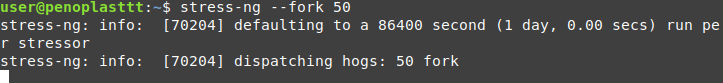

И смотрю на счетчик блокировок, который отображает, сколько раз ядро не дало процессу расплодиться

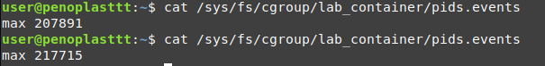

## Часть 4 - права

В линуксе есть 2 состояния: ты либо обычный пользователь и тебе ничего нельзя, либо ты root и тебе можно все. Capabilities разбивает это всемогущество root на много мелких независимых разрешений.

Использую утилиту capsh, и изменю системное время от имени root, предварительно отобрав у него право CAP_SYS_TIME
```bash
capsh --drop=cap_sys_time -- -c "date -s '2050-01-01 12:00:00'"
```
Системное время поменять не разрешили

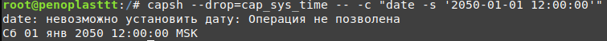

Теперь ограничу системные вызовы. За это отвечает Seccomp (Secure Computing mode), который фильтрует системные вызовы.
Для демонстрации использую systemd-run
```bash
systemd-run --user --pty --wait -p SystemCallFilter="~mkdir" bash -c "mkdir /tmp/seccomt_test"
```

Получаем статус завершения главного процесса code=dumped/status=SYS и итоговый результат core-dump

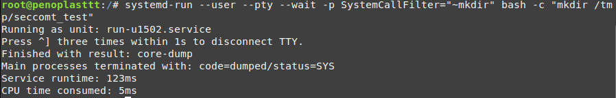

## Часть 5 - собери свой Docker

Я написала скрипт mydocker.sh и сделала файл исполняемым. При первой попытке запуска скрипта, мне прилетела ошибка

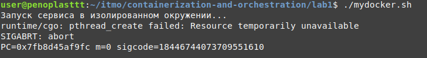

Это еще раз подтвердило,что ограничение по потокам работает. Увеличила лимит pids.max и все поднялось

Теперь запущу сервис с помощью Docker. Для этого напишу простенький Dockerfile, соберу образ и запущу контейнер
```bash
docker run --rm --name api-docker \
    --memory="50m" \
    --memory-swap="50m" \
    --cpus="0.5" \
    --pids-limit=200 \
    --cap-drop=SYS_TIME \
    -p 8080:8080 \
    api
```
Все успешно запустилось.

Оба подхода успешно изолируют сервис.

Что совпадает?
* **Изоляция пространств имен**
* **Oграничение ресурсов**
* **Ограничение прав**

Чего нет в скрипте и docker делает сверх?
* **Сетевая маршрутизация:** скрипт дает пустую сеть только с лупбэк интерфейсом, а docker создает виртуальные интерфейсы, подключает к мосту, настраивает правила и пробрасывает порты
* **Управление жизненным циклом:** после остановки скрипат папка cgroup остается, docker же подчищает все после остановки контейнера
* **Комплексная безопасность:** скрипт ограничивает только один системный вызов, а docker по умолчанию активирует seccomp-профиль, который блокирует потенциально опасные syscalls

## Часть 6 - образы

Базовый Dockerfile у меня уже готово, теперь добавлю multi-stage сборку

Разница очевидна:

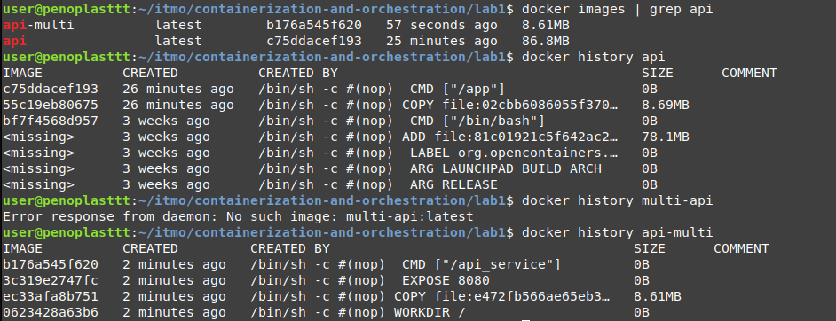

Образ с multi-stage сборкой весит в 10 раз меньше, а количество слоев также в разы меньше.

**Теперь посмотрим эфемерности и томы (или тома...)**

В образе scratch нет оболчки и утилит вроде touch или echo, не получится зайти через docker exec для ручного создания файла.

Поэтому продемонстрирую на базовом образе alpine

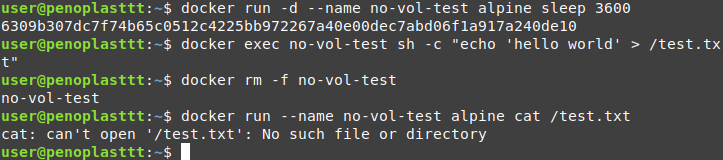

Как и ожидалось, файл не нашелся. Контейнер умер и данные пропали.

Чтобы этого не произошло, нужно примонтировать том

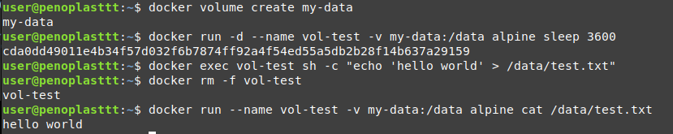

Теперь все сработало и файл пережил смерть контейнера, потому что физически он хранится на диске нашей машины.

## Часть 7 - когда контейнера мало

Команда для запуска контейнера под управлением gVisor
```bash
docker run --rm --runtime=runsc alpine dmesg
```
Главный предел контейнеров - это общее ядро ОС, что не всегда может быть достаточно безопасно.
gVisor решает эту проблему общего ядра, добавляя дополнительный защитный слой 

#### Сравнение механизмов:
| Механизм | Архитектура | Уровень безопасности | Слабое место |
| :--- | :--- | :--- | :--- |  
| **bash-скрипт** | набор флагов поверх процесса | низкий | ограничен вручную, процесс напрямую общается с ядром хоста |
| **docker** | namespaces + cgroups + мощные профили seccomp | высокий | ядро хоста, уязвимости ядра компроментируют весь сервер |
| **gVisor** | user-space ядро | очень высокий | возможны небольшие падения производииельности из-за накладных расходов на перехват вызовов |

## Часть 8 - мониторинг