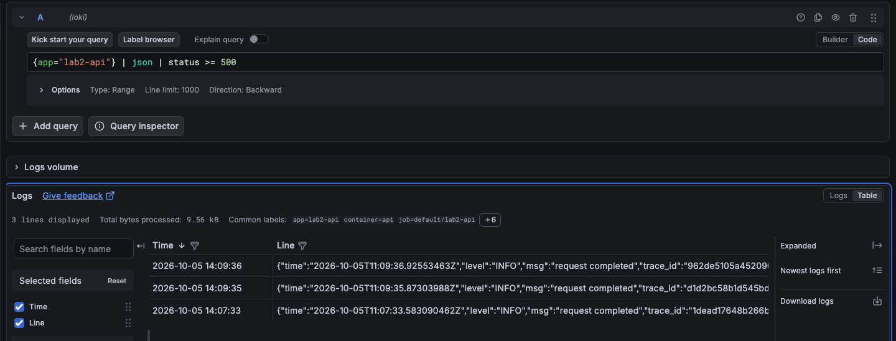
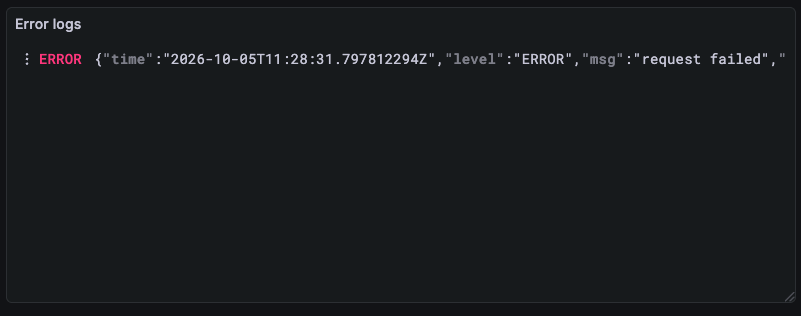
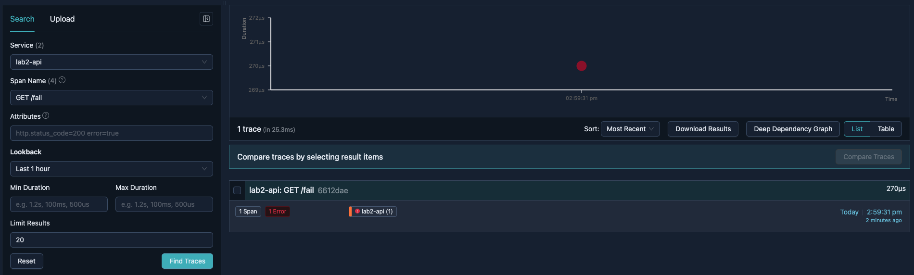
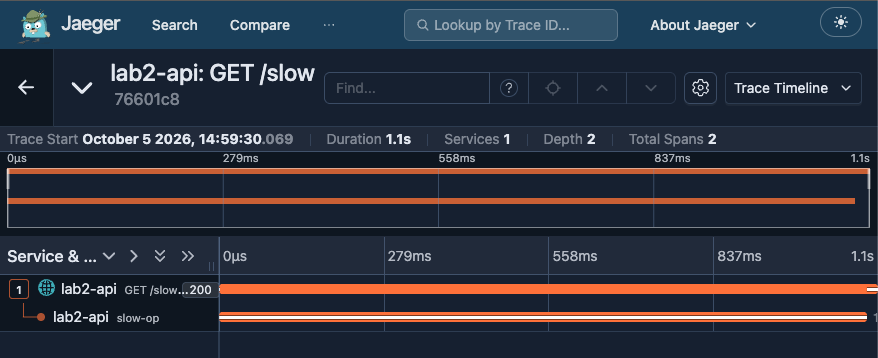
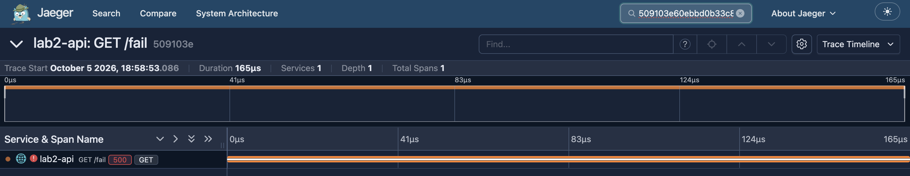
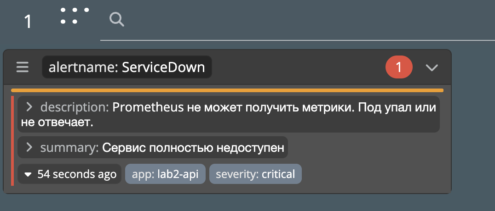
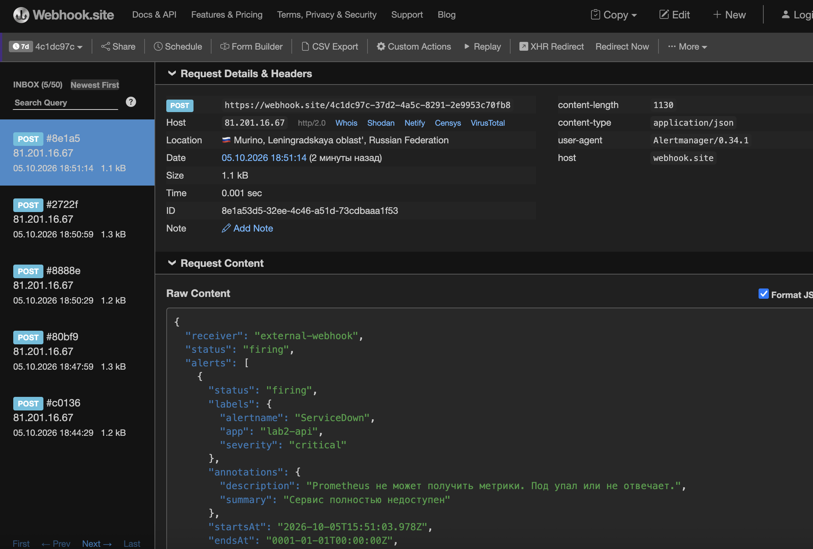
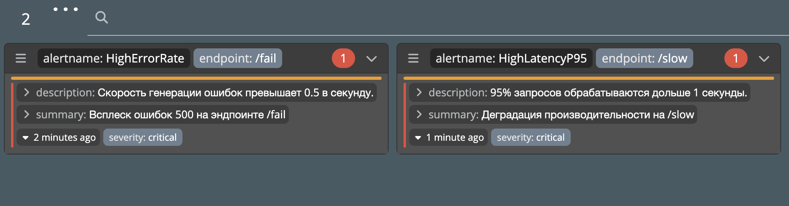

# Лабораторная работа №2 - Мониторинг сервиса

## Часть 0 - свой сервис

Написала сервис на языке Go и Dockerfile к нему с multi-stage сборкой.

Устанавливаю helm, kubectl и локальный кластер minikube

Создаю структуру helm чарта 
```bash
helm create lab2-chart
```
Подчищаю шаблоны и чарт от ненужных мне файлов и размещаю свои:
**deployments.yaml**  - отвечает за запуск самих контейнеров\
**service.yaml** - отвечает за сетевой доступ \
**values.yaml** - файл с настройками и переменными

Стартанула minikube и собрала образ сервиса внутри кластера:
```bash
minikube start
minikube image build -t lab2-api:v1 .
```
Теперь можно непосредственно задеплоить helm-чарт в кластере:
```bash
helm install lab2-release ./lab2-chart
```


Чтобы достучаться до сервиса из терминала пробрасываю порт:
```bash
kubectl port-forward svc/lab2-release-api-svc 8080:80
```
Проверяю что /health отвечает и иду дальше

## Часть 1 - метрики

Добавляю helm репозитории
```bash
helm repo add prometheus-community https://prometheus-community.github.io/helm-charts
helm repo add grafana https://grafana.github.io/helm-charts
helm repo update
```
и непосредственно устанавливаю prometheus и grafana
```bash
helm install prometheus prometheus-community/prometheus
helm install grafana grafana/grafana
```
Для графаны смотрю пароль и пробрасываю порт
```bash
kubectl get secret --namespace default grafana -o jsonpath="{.data.admin-password}" | base64 --decode ; echo
kubectl port-forward svc/grafana 3000:80
```
Теперь логинюсь в графану, подключаю prometheus и собираю дашборду по RED: интенсивность запросов, доля ошибок, p95 времени ответа.


## Часть 2 - логи

Устанавливаю хранилище логов Loki и Promtail в качестве агента
```bash
helm install loki grafana/loki-stack \
  --set promtail.enabled=true \
  --set grafana.enabled=false
```
Здесь я отключаю встроенную графану, т.к. уже есть своя.

Я долго билась с тем, чтобы подключить локи в источниках графаны. Оказалось, что все изначально заработало, но графана решила отдавать мне ошибку соединения...



Увидела баг, что 500 ошибки я возвращаю с уровнем INFO. Поправила это в коде сервиса и вывела панель с логами в дашборду



## Часть 3 - трейсы

Сначала внесу небольшие изменения в коде сервиса. Для ручки /fail помечаю спан как ошибочный. А для ручки /slow создаю вложенный спам. Пересобираю образ и обновляю релиз helm

Теперь разворачиваю Jaeger в режиме all-in-one, т.е. без данных в памяти, все в одном контейнере
```bash
helm repo add jaegertracing https://jaegertracing.github.io/helm-charts
helm repo update

helm install jaeger jaegertracing/jaeger \
  --set provisionDataStore.cassandra=false \
  --set allInOne.enabled=true \
  --set storage.type=memory
```
и прокидываю порт
```bash
kubectl port-forward svc/jaeger 16686:16686      
```

В деплойменте пришлось поменять имя для jaeger и обновить текущий релиз, тогда трейсы удалось найти

Красненький с ошибкой



И с дочерним спаном



Также проверил, что по traceID все успешно находится



## Часть 4 - алерты

Добавляю prometheus-alerts.yaml файлик и настраиваю 3 алерта:

**HighErrorRate** - ловит резкий рост HTTP 500. 
Почему важно: пользователи получают ошибки и не могут завершить свои сценарии (например, оплатить товар). Действия дежурного: посмотреть логи в Loki с фильтром status >= 500, открыть Jaeger и по trace_id найти проблемный спан, проверить доступность базы данных.

**HighLatencyP95** - ловит деградацию скорости ответа (p95 > 1 сек). Почему важно: сервис формально жив (возвращает 200 OK), но клиенты отваливаются по таймауту, а очередь запросов копится, что может привести к каскадному сбою. Действия дежурного: изучить водопад спанов в Jaeger, чтобы понять, какая конкретно вложенная операция (например, slow-op) забирает время, проверить ресурсы CPU у пода.

**ServiceDown** - ловит падение приложения. Почему важно: полный простой системы. Действия дежурного: проверить события Kubernetes (kubectl describe pod -l app=lab2-api), убедиться, что под не убит сборщиком мусора (OOMKilled) и не находится в состоянии CrashLoopBackOff.

Для наглядности использую вебхук с сайта webhook.site

Чтобы посмотреть на алерты разворачиваю Karma. Для этого пишу файлик karma.yaml, применяю манифест и пробрасываю порт
```bash
kubectl apply -f karma.yaml
kubectl port-forward svc/karma 8081:8081
```

Теперь провоцирую ситуации для алертов

Провокация ServiceDown (уничтожение подов):



Также смотрю, что на сайт прилетают посты с алертами:



И провокация HighErrorRate и HighLatencyP95:



