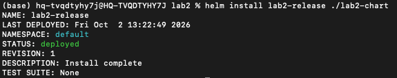
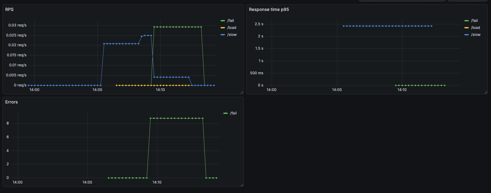

# Лабораторная работа №2 - Мониторинг сервиса

## Часть 0 - свой сервис

Написала сервис на языке Go и Dockerfile к нему с multi-stage сборкой.

Устанавливаю helm, kubectl и локальный кластер minikube

Создаю структуру helm чарта 
```bash
helm create lab2-chart
```
Подчищаю шаблоны и чарт от ненужных мне файлов и размещаю свои:
**deployments.yaml**  - отвечает за запуск самих контейнеров\
**service.yaml** - отвечает за сетевой доступ \
**values.yaml** - файл с настройками и переменными

Стартанула minikube и собрала образ сервиса внутри кластера:
```bash
minikube start
minikube image build -t lab2-api:v1 .
```
Теперь можно непосредственно задеплоить helm-чарт в кластере:
```bash
helm install lab2-release ./lab2-chart
```


Чтобы достучаться до сервиса из терминала пробрасываю порт:
```bash
kubectl port-forward svc/lab2-release-api-svc 8080:80
```
Проверяю что /health отвечает и иду дальше

## Часть 1 - метрики

Добавляю helm репозитории
```bash
helm repo add prometheus-community https://prometheus-community.github.io/helm-charts
helm repo add grafana https://grafana.github.io/helm-charts
helm repo update
```
и непосредственно устанавливаю prometheus и grafana
```bash
helm install prometheus prometheus-community/prometheus
helm install grafana grafana/grafana
```
Для графаны смотрю пароль и пробрасываю порт
```bash
kubectl get secret --namespace default grafana -o jsonpath="{.data.admin-password}" | base64 --decode ; echo
kubectl port-forward svc/grafana 3000:80
```
Теперь логинюсь в графану, подключаю prometheus и собираю дашборду по RED: интенсивность запросов, доля ошибок, p95 времени ответа.

